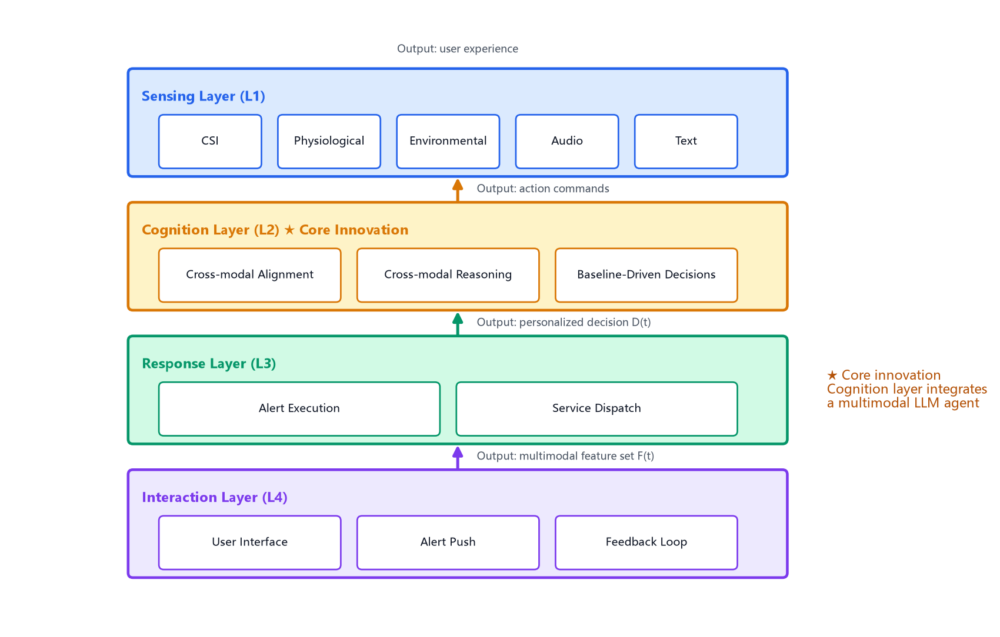
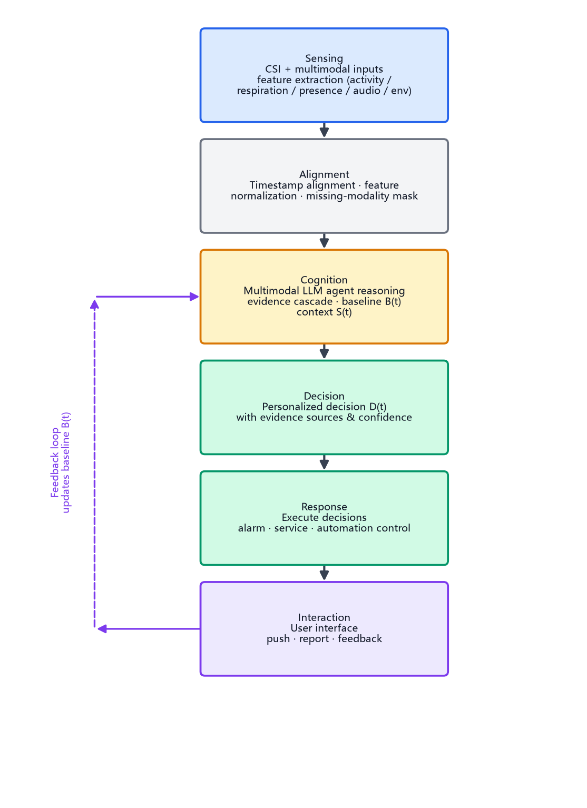
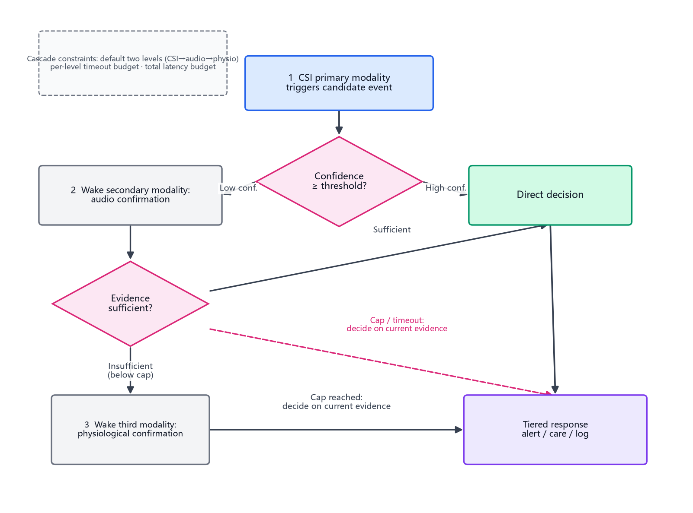
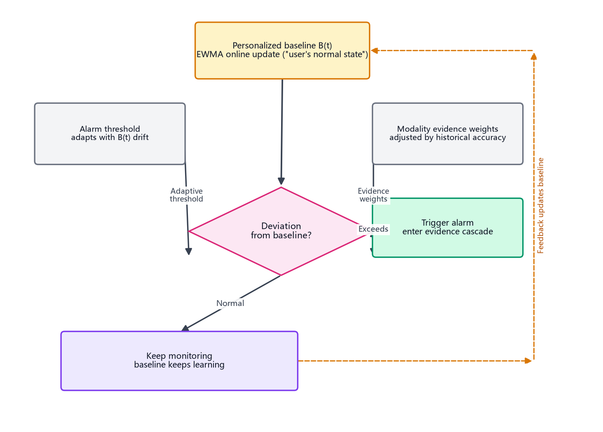
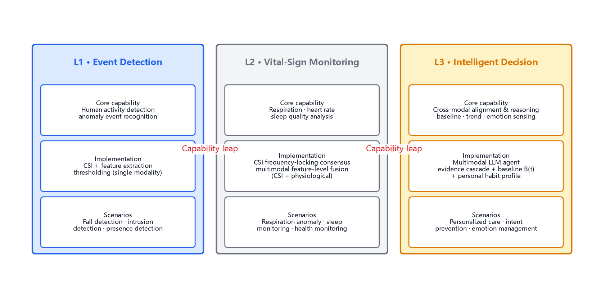
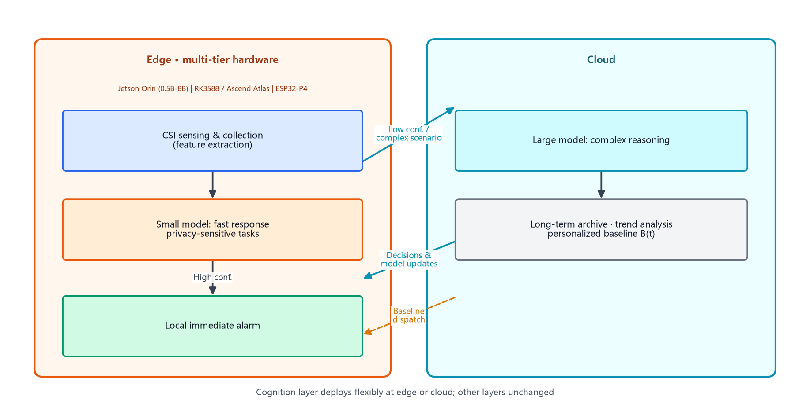

# A General Technical Framework for Integrating Multimodal LLM Agents with WiFi CSI Sensing: From Event Detection to Intelligent Decision-Making

> **Author**: Yang Bo
> **Date**: August 23, 2026
> **Version**: v1.3
> **DOI**: 10.5281/zenodo.22065374
> **Nature**: Position paper / preliminary technical report, establishing authorship priority through an academic public record

---

## Abstract

**Nature of this article**: this is a position paper / preliminary technical report that presents a technical framework and preliminary empirical results in the form of an academic public record; the completeness and maturity of the technical solutions are described as-is in the body text.

WiFi Channel State Information (CSI) sensing is a typical enabling technology: it does not constitute a product by itself; its value lies in combining with intelligent decision-making capabilities to derive rich applications across vertical scenarios (analogous to electricity relative to the appliance industry). This article proposes a general technical framework integrating multimodal Large Language Model (LLM) agents with WiFi CSI sensing. The core contribution is upgrading the traditional "event detection" paradigm (detect anomaly → raise alarm) to an "intelligent decision-making" paradigm (multimodal sensing → cross-modal alignment and reasoning → personalized-baseline-driven decision → experience loop). We present the four-layer decoupled architecture, the multimodal fusion and alignment mechanisms, the L1–L3 capability evolution roadmap, and formal definitions of the framework, and illustrate the deployment path with an application instance in the home-based elderly care scenario. We further argue that the framework can diffuse to smart healthcare, intelligent security, industrial automation, smart offices, education, smart homes, retail, sports training, and sleep medicine (not limited to the above). Preliminary empirical validation shows (validated modalities: CSI + audio; physiological and environmental modalities remain architectural design capabilities): activity detection signal-to-noise ratio (SNR) of 12.2:1 (standard: 3:1), contactless respiration detection error of 0.2 breaths/min, and a voice confirmation mechanism absorbing approximately 90% of false alarms, confirming the feasibility of the evidence cascade and personalized-baseline-driven decisions in the "CSI sensing + multimodal LLM agent" fusion path.

**Keywords**: WiFi CSI sensing; multimodal LLM agent; cross-modal alignment; multimodal fusion; personalized baseline; intelligent decision-making; enabling technology; paradigm shift

---

## 1 Introduction

### 1.1 Background

WiFi CSI (Channel State Information) sensing analyzes subtle variations in WiFi signals during propagation to precisely recognize human activities in the environment. This technology offers advantages including privacy friendliness (no image capture), unobtrusive deployment (no wearables), and good penetration (through thin walls), and is regarded as an important direction for next-generation sensing.

A central perspective of this article is that **CSI sensing is an enabling technology: the key to realizing its value lies not in the technology itself, but in continuously deriving applications across vertical scenarios after combining with a new generation of intelligent decision-making capabilities (multimodal LLM agents)**. To aid intuitive understanding, one may draw an analogy to the discovery of electricity relative to the appliance industry: electricity itself is not a product, yet combined with capabilities such as motors, lighting, and communication, it has derived an endless variety of electrical appliances. It should be noted that this analogy serves only intuitive understanding; its academic counterpart is the concept of "General Purpose Technology" (GPT) in economics—a fundamental technology that diffuses widely, improves persistently, and spawns innovation clusters [12].

### 1.2 Problem Statement

Current research and products in CSI sensing focus primarily on the "event detection" level—detecting falls, respiration anomalies, or presence. The essence of this paradigm is "standardized threshold detection": an alarm is triggered when signal variation exceeds a fixed threshold.

However, this paradigm has three fundamental limitations:
1. **Lack of contextual understanding**: it cannot integrate historical data and scenario information for comprehensive judgment;
2. **Lack of personalization**: uniform thresholds cannot adapt to differences across individuals and scenarios;
3. **Lack of intelligent decision-making**: it can only detect events, not infer intent or predict trends.

### 1.3 Contributions

1. Position CSI sensing as an enabling technology, proposing a cognitive framework in which its value realization depends on combination with intelligent decision-making capabilities;
2. Propose a general technical framework of "multimodal LLM agent + CSI sensing" with formal definitions, specifying the technical elements of cross-modal alignment, multimodal fusion strategies, and personalized baseline updating;
3. Define the paradigm-shift path from "event detection" to "intelligent decision-making", and an L1–L3 capability evolution roadmap;
4. Illustrate the deployment path with an application instance in home-based elderly care, and argue for the framework's diffusion to multiple vertical scenarios (not limited to those listed in this article).

---

## 2 Related Work

### 2.1 Development of WiFi CSI Sensing

WiFi CSI sensing has developed since the early 2010s, evolving from basic presence detection to fine-grained activity recognition.

**Foundational work**:
- Halperin et al. (2011) first introduced CSI into indoor sensing, demonstrating its significant accuracy advantage over RSSI [4].
- Wang et al. (2014) proposed the D-WFT method, achieving the first fine-grained human activity recognition based on CSI [5].
- Zhang et al. (2018) systematically surveyed CSI sensing in health monitoring, covering fall detection, respiration monitoring, and gesture recognition [6].

**Recent progress**:
- Yang et al. (2023) proposed the SenseFi benchmark dataset and open-source library, providing a standardized evaluation platform for CSI sensing research [2].
- Li et al. (2025) proposed the WiLife system, the first long-term daily status monitoring and habit mining for the elderly based on WiFi signals, validating the feasibility of CSI in long-term health monitoring [7].
- ZTE Corporation (2022) proposed a behavior habit model and anomaly early-warning scheme based on Wi-Fi Sensing, achieving activity pattern analysis and behavioral deviation detection in smart elderly care scenarios [8].

### 2.2 LLMs and Multimodal Models in Sensing

The application of LLMs in IoT/sensing has just begun and represents a frontier cross-disciplinary direction. Notably, since 2024, general-purpose LLMs have rapidly evolved from text-only models into multimodal models (e.g., GPT-4o, Gemini, Qwen-VL) capable of jointly understanding text, images, and audio; sensing systems additionally involve non-visual modalities such as CSI, physiological signals, and environmental sensors. The "multimodal LLM agent" in this article refers to an agent built on a multimodal LLM as its reasoning core, connected to heterogeneous sensing inputs through cross-modal alignment mechanisms—not merely "an LLM with simple interfaces."

**Related work**:
- Wi-Chat (2025) is the first work combining LLMs with WiFi CSI, achieving conversational environment sensing based on CSI signals [9].
- IoT-LLM (2024) proposed an LLM-driven IoT decision framework, combining sensor data with LLM reasoning for intelligent decision-making [10].
- Emerald (MIT, 2026) has applied WiFi sensing to medical health monitoring, achieving contactless respiration/heart-rate monitoring, Parkinsonian gait tracking, and sleep stage analysis [11].

**Key finding**: As of 2026, among the hundreds of papers indexed in the NTU Awesome-WiFi-CSI-Sensing repository, only 2 involve "LLM + WiFi-CSI" (Wi-Chat 2025, IoT-LLM 2024); a complete system-level work involving "multimodal LLM agent + CSI cross-modal alignment" **has not been found**, indicating that this cross-direction is in a very early stage.

**Technical feature comparison**: Table 1 compares this framework against the most relevant works feature by feature (judgments based on publicly available materials; the originals prevail), to delineate differentiating innovations:

| Technical feature | This framework | Wi-Chat [9] | IoT-LLM [10] | Emerald [11] |
|---|---|---|---|---|
| LLM cognition layer | ✅ Multimodal agent | ✅ LLM conversational | ✅ LLM decision | ❌ No LLM |
| Cross-modal alignment | ✅ Definition 4 | Not publicly reported | Not publicly reported | — |
| Personalized-baseline-driven decisions | ✅ Definition 3 | Not publicly reported | Not publicly reported | Partial (non-LLM) |
| Evidence-cascade mechanism | ✅ Sec. 3.5.3 | Not publicly reported | Not publicly reported | — |
| Privacy grading & on-demand waking | ✅ Sec. 3.5.5 | Not publicly reported | Not publicly reported | ✅ Non-visual |

**Table 1**: Technical feature comparison with the most relevant works (based on public materials; originals prevail)

This comparison shows that the combination of "evidence-cascade mechanism + personalized-baseline-driven decisions" does not fully appear in any related work outside this framework, constituting the clearest technical differentiation.

### 2.3 Limitations of Existing Approaches

Existing CSI sensing approaches concentrate on the "event detection" level and exhibit the following fundamental limitations:

1. **Lack of contextual understanding**: traditional approaches judge based only on current signal features, unable to integrate historical data, scenario information, and user profiles for comprehensive reasoning [5][6].
2. **Lack of personalization**: uniform thresholds cannot adapt to differences across individuals and environments, causing high false-alarm or miss rates [7].
3. **Lack of intelligent decision-making**: they can only detect events and trigger fixed alarms, unable to infer intent, predict trends, or generate personalized decisions [8].
4. **Lack of an experience loop**: existing approaches are mostly single-point detectors, lacking an end-to-end "sensing → cognition → interaction → service" loop.
5. **Lack of cross-modal reasoning**: existing approaches rely on a single modality (CSI) or naive concatenation, lacking temporal alignment, cross-modal reasoning, and evidence-cascade mechanisms for heterogeneous modalities.

The framework proposed in this article directly addresses these limitations by introducing a multimodal LLM agent as the "cognition layer", achieving the paradigm shift from "event detection" to "intelligent decision-making".

---

## 3 General Technical Framework

### 3.1 Formal Definitions

Let the CSI signal stream be $C(t) = \{c_1(t), c_2(t), \ldots, c_N(t)\}$, where $c_i(t)$ is the complex channel response of the $i$-th subcarrier at time $t$, and $N$ is the number of subcarriers ($N=192$ in our empirical system).

**Definition 1 (Sensing mapping)**: The sensing layer defines a mapping $f_{sense}: C(t) \rightarrow F^{CSI}(t)$, where $F^{CSI}(t) = \{f_{act}(t), f_{resp}(t), f_{pres}(t), \ldots\}$ is a CSI feature vector corresponding to semantic features such as user activity intensity, respiration rhythm, and presence state.

**Definition 2 (Multimodal sensing set)**: The input to the cognition layer is a multimodal feature set $\mathcal{F}(t) = \{F^{CSI}(t), F^{physio}(t), F^{env}(t), F^{audio}(t), F^{text}(t)\}$, where:
- $F^{CSI}(t)$: CSI sensing features (activity, respiration, presence);
- $F^{physio}(t)$: physiological signal features (heart rate, respiration rate, and other auxiliary physiological data);
- $F^{env}(t)$: environmental context features (time, location, temperature/humidity, scenario category);
- $F^{audio}(t)$: audio cue features (voice-confirmation responses, environmental sound events);
- $F^{text}(t)$: textual cue features (user preference records, medical history entries, interaction logs).

**Definition 3 (Cognition mapping)**: The cognition layer defines a mapping $f_{cog}: (\mathcal{F}(t), H, B(t), S(t)) \rightarrow D(t)$, where:
- $H$ is the user's static context (e.g., medical history, preference profile);
- $B(t)$ is the personalized baseline (updated dynamically over $t$, characterizing the statistical model of "this user's normal state");
- $S(t)$ is the scenario context (time, location, environmental state);
- $D(t)$ is the personalized decision output (alarm policy, recommendations, control commands).

**Definition 4 (Cross-modal alignment mapping)**: The cognition layer first applies an alignment mapping $f_{align}: \mathcal{F}(t) \rightarrow \mathcal{\tilde{F}}(t)$ that aligns heterogeneous modalities onto a unified time axis and a comparable feature space, including: timestamp alignment (resampling to a unified clock), cross-modal feature normalization (standardizing each modality to a consistent distribution), and robust handling of missing modalities (masked placeholders or degraded reasoning without interrupting decisions).

**Definition 5 (Paradigm shift)**: The traditional event-detection paradigm satisfies $D(t) = g(F^{CSI}(t); \theta_0)$ (global fixed threshold $\theta_0$, single modality); our intelligent decision-making paradigm satisfies $D(t) = f_{cog}(f_{align}(\mathcal{F}(t)), H, B(t), S(t); \Theta)$, where decisions are jointly determined by multimodal evidence, individual context, and history. The difference between these two formulations constitutes the core contribution of this article.

### 3.2 Four-Layer Decoupled Architecture

Figure 1 illustrates the four-layer decoupled architecture of the framework:

**Figure 1**: Four-layer decoupled architecture

**Key innovation**: Layer 2, the "cognition layer", introduces a multimodal LLM agent with three core responsibilities: **(1) cross-modal alignment**—aligning heterogeneous modalities (CSI, physiological, environmental, audio, textual) onto a unified time axis and feature space; **(2) cross-modal reasoning**—context-aware reasoning over aligned multimodal evidence (instead of a rule engine); **(3) personalized-baseline-driven decisions**—generating personalized decisions $D(t)$ based on the dynamically updated individual baseline $B(t)$.

Layers are decoupled through well-defined interfaces: the sensing layer outputs the multimodal feature set $\mathcal{F}(t)$, the cognition layer outputs decisions $D(t)$, the response layer converts decisions into actions, and the interaction layer converts actions into user experience. This decoupled design enables plug-and-play upgrading of sensing hardware (e.g., mmWave radar or Wi-Fi 8 sensing-capable APs can replace the sensing layer without affecting upper layers) and allows the cognition layer to evolve with multimodal LLM capabilities without modifying other layers; adding a new modality requires only a sensing-layer interface and an alignment module—plug-and-play.

### 3.3 Core Capabilities of the Multimodal LLM Agent

Table 1 compares core capabilities between traditional approaches and the multimodal LLM-agent approach:

| Capability | Traditional approach | Multimodal LLM-agent approach |
|---|---|---|
| **Input modalities** | Single CSI signal | CSI + physiological + environmental + audio + text (plug-and-play) |
| **Contextual understanding** | None (current signal only) | Historical data + scenario info + cross-modal evidence |
| **Personalization** | Uniform thresholds | Individual baselines, personalized per user |
| **Intent inference** | Not possible | Infer behavioral intent (fall vs. lying down) |
| **Trend prediction** | Post-hoc alarms | Proactive early warning ("activity declined for 7 consecutive days") |
| **Cross-modal reasoning** | None | Evidence cascade: CSI anomaly + audio confirmation + history linkage |
| **Privacy control** | Undifferentiated | Sensitive modalities woken on demand; de-identification |

**Table 2**: Capability comparison between multimodal LLM agents and traditional approaches

### 3.4 Intelligent Decision Flow

Figure 2 illustrates the end-to-end intelligent decision flow of the framework:

**Figure 2**: End-to-end intelligent decision flow

### 3.5 Implementation Essentials of Multimodal Fusion and Alignment

To make the framework implementable and reproducible, this section specifies key implementation elements of multimodal fusion and alignment.

**3.5.1 Input Modality Set** (trimmable per scenario; degrades gracefully when absent)

| Modality | Source | Typical features | Privacy level |
|---|---|---|---|
| CSI | ESP32-S3 etc. WiFi devices | Activity intensity, respiration rhythm, presence | Low (non-visual) |
| Physiological | mmWave radar / optional wearables | Heart rate, respiration rate | Medium |
| Environmental | Temp/humidity/time/location | Scenario context | Low |
| Audio | Voice confirmation, ambient sound | Response status, abnormal sounds | Medium (de-identified) |
| Text | Preferences, medical history, logs | Static context H | High (encrypted storage) |

**3.5.2 Modality Alignment Strategies**

- **Timestamp alignment**: all modalities resampled onto a unified clock (frame-level alignment), eliminating per-sensor clock drift;
- **Cross-modal feature normalization**: each modality standardized (e.g., z-score) to a consistent distribution to prevent magnitude differences from dominating fusion;
- **Robust handling of missing modalities**: a missing modality is masked and reasoning degrades gracefully (e.g., audio channel failure → CSI-only decisions), preserving system availability.

**3.5.3 Cross-Modal Fusion Methods** (three progressive levels, chosen by confidence requirements)

1. **Feature-level fusion**: aligned features concatenated into a joint vector for joint encoding by the multimodal model (for complete-modality, compute-sufficient scenarios);
2. **Decision-level fusion**: each modality reasons independently, then results are aggregated by modality evidence weights (low compute cost, high interpretability);
3. **Evidence-cascade mechanism**: the primary modality (CSI) triggers candidate events → secondary modalities (audio/physiological) are woken on demand for confirmation → high-confidence events are decided directly; low-confidence events wake further modalities, forming a demand-driven evidence chain.

**Cascade-depth control and timeout degradation**: to avoid latency accumulation from multiple rounds of reasoning, the evidence cascade adopts the following constraints: **(1) maximum cascade rounds**—the modality-waking chain per event is capped (default two levels, e.g., CSI → audio → physiological); once the cap is reached, the decision is made on current evidence regardless of confidence; **(2) timeout degradation rule**—each confirmation level carries a timeout budget; if a secondary modality fails to return within budget, the system degrades and decides on current evidence (conservatively: escalate the alarm or fall back to the rule-based version), keeping the system latency bound finite; **(3) latency budget allocation**—the total response budget (e.g., 3 s) is pre-allocated by cascade depth: shallow cascades (single-modality high confidence) receive the full budget, while deep cascades compress reasoning time per level. This constraint design reconciles "evidence cascade" with "real-time response" and also constitutes a concrete technical feature worthy of priority verification in future research.

**Figure 3**: Evidence-cascade mechanism (with cascade-depth control and timeout degradation)

**3.5.4 Decision Output and Adaptive Mechanisms**

- Decision $D(t)$ is jointly supported by multimodal evidence and carries its evidence sources and confidence for user auditing;
- **Personalized baseline updating**: $B(t)$ is updated online (e.g., exponentially weighted moving average, EWMA), characterizing "this user's normal state"; baseline deviation is a core decision input;
- **Dynamic adjustment of modality evidence weights**: weights are adjusted by each modality's historical accuracy—higher-accuracy modalities automatically gain more influence;
- **Threshold adaptation**: alarm thresholds migrate adaptively with the individual baseline $B(t)$, avoiding the one-size-fits-all problem of fixed thresholds.

**Core feature combination**: across the framework, "evidence-cascade mechanism (Sec. 3.5.3) + personalized-baseline-driven adaptive decisions (this section)" constitutes **the combination with the most concrete technical features and the clearest differentiation from existing work (Wi-Chat, IoT-LLM)**—the core innovation proposed by this article: the evidence cascade addresses "on-demand multimodal confirmation", while the personalized baseline addresses "personalized decisions"; together they achieve the leap from fixed-threshold alarms to context-adaptive decisions. This combination can serve as the core direction for priority verification in subsequent research; the remaining innovations (four-layer decoupling, three-level fusion, L1–L3 roadmap, etc.) serve as supporting features or extended research directions.

**Figure 5**: Personalized baseline and threshold-adaptive decision loop

**3.5.5 Embedding Points for Security and Privacy Protection**

- **Access control for sensitive modalities**: high-privacy modalities (textual history, physiological) are off by default, woken on demand only for high-confidence event confirmation;
- **De-identification**: audio cues extract only event-level features (responded / not responded) without storing raw audio; textual history is encrypted at rest with least-privilege access;
- **Local-first processing**: feature extraction of privacy-sensitive data is performed locally; the cloud receives only feature vectors and decision outputs (see edge-cloud collaboration, Section 8.2).

---

## 4 L1–L3 Capability Evolution Roadmap

Figure 4 illustrates the L1–L3 capability evolution roadmap of the framework:

**Figure 4**: L1–L3 capability evolution roadmap

### 4.1 L1: Event Detection

- **Core capability**: human activity detection, anomalous event recognition
- **Implementation**: CSI acquisition + feature extraction + threshold judgment (single modality)
- **Scenarios**: fall detection, intrusion detection, presence detection

### 4.2 L2: Vital Sign Monitoring

- **Core capability**: respiration monitoring, heart-rate monitoring, sleep quality analysis
- **Implementation**: CSI frequency-locking consensus, feature-level multimodal fusion (CSI + physiological)
- **Scenarios**: respiration anomaly warning, sleep monitoring, health monitoring

### 4.3 L3: Intelligent Decision-Making

- **Core capability**: cross-modal alignment and reasoning, personalized baselines, trend prediction, emotion sensing
- **Implementation**: multimodal LLM agent + evidence cascade + personalized baseline $B(t)$ + personal habit profiles
- **Scenarios**: personalized guardianship, intent inference, proactive prevention, emotion management

---

## 5 Multi-Scenario Applications

The proposed general technical framework has broad applicability; its core is the fusion architecture of "multimodal LLM agent + CSI sensing", which is not restricted to specific application scenarios. **The following scenarios are illustrative only and do not constitute a limitation of the framework's application scope.** Any scenario requiring "unobtrusive human state monitoring + intelligent decision-making" can apply this framework.

### 5.1 Seed Application: Home-Based Elderly Care (Validated)

**Technical fit**: this scenario requires unobtrusive monitoring of elderly activity state, respiration rhythm, and emotional changes, combined with medical history for personalized alarm decisions; the modality set is CSI (activity/respiration) + audio (voice confirmation) + text (medical history).

**Deployment instance (end-to-end home guardianship system)**: The author built an end-to-end guardianship system in the home-based elderly care scenario as the seed application of this framework, with a complete pipeline implemented (the proof of concept in Section 7 is based on this system):
- Fall event detection → multimodal agent fuses medical history (e.g., history of myocardial infarction) → generates personalized alarm policy (immediate alarm vs. voice confirmation first);
- Respiration rhythm anomaly monitoring → cross-modal reasoning (activity pattern + respiration pattern) → infer emotional state (loneliness/depression) → generate care recommendations;
- Long-term activity trend analysis → detect baseline deviation (activity decline over consecutive days) → infer increased health risk → generate medical consultation advice;
- Voice confirmation loop → suspicious events first prompt the elderly with "Are you okay?"; a response cancels the alarm, no response escalates it → absorbs approximately 90% of false alarms (Section 7 measurements).

This seed application validates the feasibility of the "CSI sensing + multimodal LLM agent" fusion path. The following scenarios are diffusion concepts based on the framework's generality (not yet experimentally validated).

### 5.2 Smart Healthcare (Concept)

**Technical fit**: this scenario requires unobtrusive monitoring of post-operative patient activity, behavioral patterns of psychiatric patients, and physiological indicators such as sleep-disordered breathing; physiological modalities (heart rate/oxygen) can be added.

**Application examples**:
- Post-operative patient activity monitoring → detect abnormal activity patterns → multimodal agent infers complication risk → graded alarm
- Behavioral pattern analysis of psychiatric patients → identify self-harm tendencies (specific behavior sequences) → agent infers risk level → graded intervention
- Sleep apnea detection → infer severity (based on apnea frequency, oxygen desaturation inference) → generate medical consultation advice

### 5.3 Intelligent Security (Concept)

**Technical fit**: this scenario requires distinguishing "human/pet/object", inferring behavioral intent (loitering/intrusion/normal passage), and graded response.

**Application examples**:
- Indoor anomalous movement detection when unoccupied → multimodal agent distinguishes "pet" vs. "human" (based on activity patterns and body-size inference) → intelligent alarm
- Behavioral sequence analysis in sensitive zones → infer intent (loitering vs. intrusion vs. normal passage) → graded response (notice/alarm/coordination)
- Multi-person scenario differentiation → identify strangers (based on activity pattern baselines) → security warning

### 5.4 Industrial Automation (Concept)

**Technical fit**: this scenario requires monitoring worker operation compliance, personnel presence in high-risk zones, and fatigue state.

**Application examples**:
- Worker operation sequence monitoring → detect non-compliant actions (deviating from standard procedures) → multimodal agent infers safety risk level → graded intervention
- Personnel presence detection in high-risk zones → trigger automatic equipment shutdown → accident prevention
- Worker fatigue detection (activity pattern changes, micro-motion features) → infer accident risk → rest reminders

### 5.5 Smart Office (Concept)

**Technical fit**: this scenario requires analyzing workstation usage patterns, employee health states, and meeting-room occupancy efficiency.

**Application examples**:
- Workstation occupancy pattern analysis → multimodal agent infers usage patterns → optimize space allocation strategies
- Detection of prolonged employee inactivity → infer health issues (based on activity baseline deviation) → rest reminders
- Meeting-room occupancy and activity analysis → infer meeting efficiency (based on activity patterns, occupant density) → scheduling optimization suggestions

### 5.6 Education (Concept)

**Technical fit**: this scenario requires monitoring student concentration, classroom behavior patterns, and learning stress.

**Application examples**:
- Student concentration monitoring (activity patterns, micro-motion features) → multimodal agent analyzes attention patterns → generate teaching-pace adjustment suggestions
- Classroom anomalous behavior recognition → infer emotional states (anxiety/confusion/boredom) → generate personalized tutoring suggestions
- Long-term student activity analysis → infer learning stress (based on activity baseline deviation) → generate rest suggestions

### 5.7 Smart Home (Concept)

**Technical fit**: this scenario requires presence detection, personalized automation control, and daily-routine inference.

**Application examples**:
- Presence detection → multimodal agent infers user habits → automated control (lighting, temperature, music)
- Multi-person differentiation → personalized services (based on individual preference baselines) → automated scene switching
- Activity pattern analysis → infer daily routines → automated scene presets

### 5.8 Retail (Concept)

**Technical fit**: this scenario requires analyzing customer behavior patterns, in-store traffic distribution, and product attention levels.

**Application examples**:
- Customer behavior sequence analysis → multimodal agent infers purchase intent → generate personalized recommendations
- Spatio-temporal in-store traffic analysis → infer peak hours and hot zones → optimize staffing and product placement
- Customer dwell-time and activity pattern analysis → infer points of product interest → optimize marketing strategies

### 5.9 Sports Training (Concept)

**Technical fit**: this scenario requires analyzing athlete movement patterns, training load, and fatigue levels.

**Application examples**:
- Athlete movement pattern analysis → multimodal agent infers technical deficiencies → generate personalized training plans
- Long-term training load monitoring → infer fatigue levels (based on activity baseline deviation) → prevent sports injuries
- Comparative movement pattern analysis → infer technical improvement points → optimize training plans

### 5.10 Sleep Medicine (Concept)

**Technical fit**: this scenario requires analyzing sleep quality, respiratory events, and body-position changes.

**Application examples**:
- Multi-dimensional sleep quality analysis (respiration rhythm, movement frequency, bed-exit count) → multimodal agent infers sleep disorder types → generate personalized intervention plans
- Apnea event detection → infer severity (based on apnea frequency and duration) → generate medical consultation advice
- Turning frequency and posture analysis → infer sleep-depth distribution → optimize sleep environment suggestions

### 5.11 Other Potential Scenarios (Concept)

The generality of the framework enables application to further vertical domains, including but not limited to:

- **Rehabilitation medicine**: monitoring patient rehabilitation training movements → infer recovery progress → optimize training plans
- **Psychological counseling**: analyzing micro-movement patterns of clients → infer emotional states → assist psychological assessment
- **Prison management**: monitoring inmate behavior patterns → infer anomalous behavior → security warnings
- **Hospitality**: analyzing guest daily-routine patterns → infer service needs → personalized services
- **Library management**: seat occupancy analysis → infer usage patterns → optimize resource allocation

**The above scenarios are illustrative only; the framework's application scope is not limited to them. Any scenario requiring "unobtrusive human state monitoring + intelligent decision-making" can apply this framework. The seed application has validated the feasibility of the fusion path; subsequent scenarios can reuse the sensing-layer and cognition-layer capabilities of the same framework, adapting only the response and interaction layers and extending scenario-specific modalities through plug-and-play modality interfaces.**

---

## 6 Technical Advantages

### 6.1 Comparison with Traditional Approaches

| Dimension | Traditional approach | Proposed framework |
|---|---|---|
| **Sensing** | CSI signal → feature extraction (single modality) | CSI + multimodal inputs → extraction + alignment |
| **Cognition** | Rule engine / threshold judgment | **Multimodal LLM agent (cross-modal alignment + reasoning)** |
| **Decision** | Fixed logic | **Personalized-baseline-driven decisions** |
| **Interaction** | Simple alarms | **Experience loop (feedback updates baseline)** |

### 6.2 Core Advantages

1. **Generality**: one framework applicable to multiple vertical scenarios, with plug-and-play modalities
2. **Personalization**: multimodal agent learns individual baselines—personalized for every user
3. **Intelligence**: upgrading from "event detection" to "cross-modal intelligent decision-making"
4. **Extensibility**: four-layer decoupled architecture enabling independent evolution of sensing hardware and reasoning capabilities
5. **Privacy friendliness**: non-visual sensing + on-demand waking of sensitive modalities + de-identification

---

## 7 Proof of Concept

To validate the feasibility of the framework, the author built an end-to-end guardianship system in the home-based elderly care scenario and conducted a preliminary proof of concept (PoC) based on this system.

### 7.1 Ethics Statement and Data Governance

All human monitoring data collection in this study was completed with the voluntary participation of the author's family members (family self-testing). All participants were informed of the experimental purpose, monitoring method, and data handling before the experiments and gave oral consent. The data were used solely for technical validation purposes and involved no commercial use.

Data governance principles for multimodal data (framework design; partially implemented in the PoC):

1. **Data minimization**: data are collected only on necessary modalities, minimizing sensitive-information exposure from cross-modal inference; in the PoC, the textual medical-history modality was used with minimal fields;
2. **Consent and withdrawal**: a clear user consent form template is designed; users may delete their data or withdraw from monitoring at any time; data of minors and third parties are handled per statutory guardianship and authorization requirements;
3. **Storage and access control**: partitioned storage (raw signals, feature vectors, and decision outputs isolated), least-privilege principles, encrypted transmission (TLS), and access-log auditing;
4. **Regional regulatory alignment**: the Chinese market follows the Personal Information Protection Law (PIPL) and the minimal-necessity principle of GB/T 35273-2020; overseas markets align with GDPR (EU, including data portability and erasure rights) and HIPAA (US, health data protection) respectively; per-market compliance paths are further discussed in Section 8.3;
5. **Boundaries of sensitive inference**: emotion/health-state inference results serve only care and reminders, not evaluation or commercial profiling; inference outputs carry explanations, and users can disable specific inference capabilities.
6. **Special compliance clause for emotion/psychological inference**: since inferences of emotional/psychological states (e.g., loneliness, depressive tendencies) fall into highly sensitive categories in most jurisdictions (GDPR classifies mental-health information as "health data" in a special category; China strictly protects mental-health-related data), this framework imposes specific constraints on such inferences: **(1) non-diagnosis statement**—emotion/psychological inference results do not constitute any medical or psychological diagnosis and serve only as reference information for care reminders; **(2) higher-level explicit consent**—enabling emotion/psychological inference requires the user's separate explicit consent (distinct from general monitoring consent), and users may individually disable it at any time; **(3) presentation constraints**—such inference results are shown only to the user or an authorized guardian, never entering the alarm chain nor any automated decision-making (e.g., insurance pricing, employment evaluation); **(4) minimal retention**—intermediate features of emotion inference are not persisted; only inference conclusions are retained and deleted after a limited period.

### 7.2 Experimental Setup

- **Hardware**: ESP32-S3 development boards ×2 (TX transmitter / RX receiver), ESP-NOW protocol, channel 11, HT40, 100 packets/s, 192 subcarriers, effective frame rate approximately 71–73 frames/s
- **Environment**: indoor home environment, doors and windows closed, no fan/air-conditioner airflow, single person present
- **Deployment**: boards spaced 1–3 m apart, subject at the midpoint of the line connecting the two boards, chest facing the line
- **Modality configuration**: CSI (activity/respiration) + audio (voice confirmation) + text (minimal medical-history fields); CSI served as the primary modality and audio as the secondary modality in the evidence cascade. **Note: of the five-modality set, only the above CSI + audio (partially degraded to a rule-based version during some periods) + minimal text fields have been validated; the physiological and environmental modalities remain architectural design capabilities (Sec. 3.5.1) and have not been measured**; their empirical validation is scheduled in the extended PoC (Sec. 7.6).
- **LLM**: Qwen API (voice confirmation partially degraded to a rule-based version during testing due to API authentication issues)
- **Monitored dimensions**: activity detection, respiration monitoring, daily routine patterns

### 7.3 Preliminary Results

Table 2 summarizes key empirical results of the proof of concept:

| Metric | Measured result | Criterion | Verdict |
|---|---|---|---|
| Activity detection SNR | **12.2:1** | ≥ 3:1 | ✅ Passed (4× above standard) |
| Respiration detection error | **0.2 breaths/min** (controlled 12 breaths/min, measured 12.2) | ≤ ±2 breaths/min | ✅ Passed |
| Breath-holding control | Subcarrier frequency-locking consensus during breathing; consensus collapses during breath-holding | Periodic peaks disappear with breath-holding | ✅ Passed |
| Voice confirmation false-alarm reduction | Absorbs ~90% of false alarms (estimate) | — | ⚠ Pending quantitative validation |

**Table 3**: Key empirical results of the proof of concept

### 7.4 Case Studies

**Case 1: Voice confirmation loop (evidence-cascade instance)**
- Scenario: the system detects a suspected fall event
- Framework behavior: the multimodal agent initiates a voice query "Are you okay?" → a response cancels the alarm; no response escalates it (audio modality cascades after the CSI primary modality)
- Outcome: false alarms are absorbed through interaction, leaving alarm pushes for events that truly require them; family members reported "greater peace of mind"

**Case 2: Activity/respiration dual-evidence cross-validation (cross-modal evidence cascade)**
- Scenario: dual signal lines of activity detection and respiration monitoring cross-validate; alarms escalate only with dual evidence
- Outcome: single-signal misjudgments are avoided, reducing the false-alarm rate (mechanism validated; quantitative value pending)

### 7.5 Summary

Preliminary validation shows that the "CSI sensing + multimodal LLM agent" fusion path is technically feasible: activity detection SNR exceeds the standard by 4×, and contactless respiration detection error is 0.2 breaths/min. However, due to the small sample size (family members, single-room environment), the results do not yet have statistical significance and require larger-scale experimental validation. The "90%" figure for voice-confirmation false-alarm reduction is a current estimate, pending quantitative experimental confirmation.

### 7.6 Extended PoC Design (Blueprint for Future Experiments)

To strengthen persuasiveness and reproducibility, the extended PoC proceeds as follows:

1. **Extended modality set**: CSI + physiological signals (respiration/heart rate) + scenario context + voice/audio cues, validating full-modality evidence cascades;
2. **Evaluation metrics**: precision, recall, specificity, F1, robustness (performance under missing/interfered modalities), response latency, and privacy-compliance metrics (sensitive-data exposure surface, de-identification coverage);
3. **Experimental design**: multiple room types/furniture layouts, different subjects and scenarios, long-term evaluation across time periods, with a control group (traditional threshold approach) for effect comparison;
4. **Statistical analysis**: significance tests (paired t-test / Wilcoxon), confidence intervals, and effect sizes against the baseline.

---

## 8 Discussion

### 8.1 Limitations

The framework has the following limitations:

1. **CSI environmental sensitivity**: CSI signals are susceptible to environmental changes (furniture movement, door/window opening, electrical interference), requiring periodic calibration. Cross-environment transferability is a recognized open problem in CSI sensing [2][6].
2. **LLM inference latency**: LLM inference may take 1–3 seconds, unsuitable for real-time alarm scenarios requiring millisecond-level response. Future work can reduce latency through edge computing (offloading inference to local devices).
3. **Privacy compliance**: personalized baselines involve sensitive data (activity patterns, respiration data, emotion inference), and multimodal extension further enlarges the data surface; strict compliance with regulations such as the PIPL is required, implementing data minimization, partitioned storage, and withdrawal mechanisms.
4. **Limited PoC scale**: current validation is limited to family members in a single-room environment with a small sample size; the statistical significance of the results requires larger-scale experiments. The "90%" figure for voice-confirmation false-alarm reduction is an estimate, not yet quantitatively validated.
5. **Missing empirical evidence for multimodal fusion**: the PoC validated only the two-level CSI + audio evidence cascade; joint reasoning across physiological, environmental, and textual modalities has not been measured—i.e., the "multimodal" in the title and abstract currently reflects architectural design capability rather than complete empirical capability. The robustness of cross-modal alignment in real deployments awaits validation; the extended PoC (Sec. 7.6) will prioritize measured physiological modalities—the largest gap in current empirical persuasiveness.

### 8.2 Future Work

Future work includes:

1. **Cross-environment transfer**: investigate cross-environment generalization of CSI models to reduce deployment calibration costs, drawing on transfer learning and domain adaptation.
2. **Edge computing and edge-cloud collaboration**: offload multimodal reasoning to edge devices to reduce latency and protect privacy. Current edge platforms have formed multi-tier options: embedded GPUs (e.g., NVIDIA Jetson Orin series, capable of running 0.5B–8B parameter models), domestic NPUs (e.g., Rockchip RK3588, Huawei Ascend Atlas, preferred for cost-sensitive scenarios), and lightweight SoCs (e.g., ESP32-P4, supporting only very small models). More practical in engineering is the **edge-cloud collaborative architecture**: small-parameter models on the edge handle rapid response and privacy-sensitive tasks, while large-parameter models in the cloud handle complex reasoning and long-term trend analysis. The four-layer decoupled architecture of this framework natively supports this deployment mode—the cognition layer can be flexibly deployed on edge boxes or in the cloud without modifying other layers.

**Figure 6**: Edge-cloud collaborative deployment architecture

3. **Deepening multimodal fusion**: implement the complete modality set per the Section 3.5 blueprint, validate the optimal choice among the three fusion levels (feature-level, decision-level, evidence cascade) across scenarios, and complete the evaluation metrics and statistical analyses of the extended PoC.
4. **Large-scale validation**: conduct large-scale experiments across multiple homes and scenarios to validate the framework's generality and robustness.
5. **IEEE 802.11bf adaptation**: track the progress of WLAN sensing standards to ensure compatibility with native sensing capabilities of future WiFi chipsets.

### 8.3 Open Challenges and Risk Mitigation

The framework faces the following challenges and corresponding mitigations:

1. **Standardization**: a unified CSI sensing standard is lacking; different hardware platforms differ in CSI data formats, sampling rates, and subcarrier counts, affecting model portability. **Mitigation**: the four-layer decoupled architecture uses feature vectors as interfaces, shielding underlying differences; monitor IEEE 802.11bf progress.
2. **Data flywheel**: large-scale real-world scenario data are needed to train models, but data collection involves privacy, making acquisition difficult. **Mitigation**: privacy-preserving computation (federated learning, differential privacy); progressive data accumulation starting from family self-testing.
3. **Ecosystem compatibility**: compatibility—rather than confrontation—with major ecosystems (Huawei/Xiaomi/Haier) is needed. The four-layer decoupled architecture provides a foundation, but concrete implementation still requires effort. **Mitigation**: participate in ecosystems through open interfaces, focusing on differentiated cognition-layer capabilities.
4. **User acceptance**: user acceptance of "unobtrusive monitoring" and privacy concerns about "emotion inference" must be built gradually through actual product experience. **Mitigation**: transparent and explainable inference results, user-disableable sensitive inference, clear consent and withdrawal mechanisms.
5. **Academic novelty boundary**: multimodal fusion is a crowded research field; the technical novelty of this framework depends on the specific technical elements of cross-modal alignment and evidence cascades. **Mitigation**: continuously track academic literature and industrial developments in the field; clearly delineate differentiating technical features (personalized-baseline-driven adaptive decisions, robust handling of missing modalities, evidence-cascade mechanisms).
6. **Statistical insignificance risk**: small-sample PoC conclusions are vulnerable to challenge. **Mitigation**: strictly follow the Section 7.6 blueprint with control groups and statistical tests; avoid overclaiming.

---

## 9 Conclusion

Starting from the cognitive framework that "CSI sensing, like electricity, is a foundational technological discovery", this article points out that the key to realizing its value lies in continuously deriving applications across vertical scenarios after combining with a new generation of intelligent decision-making capabilities. On this basis, we propose a general technical framework integrating multimodal LLM agents with WiFi CSI sensing:

1. **Formal level**: define the sensing mapping $f_{sense}$, the cross-modal alignment mapping $f_{align}$, and the cognition mapping $f_{cog}$, clarifying the formal difference between the traditional event-detection paradigm (single-modality fixed thresholds) and the intelligent decision-making paradigm (multimodal evidence + individual context adaptation);
2. **Architecture level**: propose the four-layer decoupled architecture (sensing → cognition → response → interaction), where the cognition layer assumes three core responsibilities—cross-modal alignment, cross-modal reasoning, and personalized-baseline-driven decisions—with well-defined interfaces enabling independent evolution of sensing hardware and reasoning capabilities;
3. **Fusion level**: provide implementable multimodal essentials—the input modality set, timestamp alignment and robust handling of missing modalities, the three-level cross-modal fusion methods (feature-level / decision-level / evidence cascade), personalized baseline updating, and dynamic adjustment of modality evidence weights;
4. **Capability level**: define the L1–L3 capability evolution roadmap (event detection → vital sign monitoring → intelligent decision-making), providing a clear upgrade path for different maturity stages;
5. **Deployment level**: the end-to-end guardianship system in the home-based elderly care scenario has been implemented, with preliminary empirical validation of the fusion path's feasibility (activity detection SNR 12.2:1, respiration detection error 0.2 breaths/min, voice confirmation absorbing ~90% of false alarms), together with an extended-PoC experimental blueprint;
6. **Diffusion level**: argue that the framework can diffuse to smart healthcare, intelligent security, industrial automation, smart offices, education, smart homes, retail, sports training, and sleep medicine (not limited to the above); the sensing-layer and cognition-layer capabilities validated by the seed application can be reused by subsequent scenarios.

All technical ideas, architectural designs, and application scenario concepts in this article are original, written on August 23, 2026, establishing authorship priority through an academic public record. This article is permanently archived on Zenodo (DOI: 10.5281/zenodo.22065374).

---

## References

[1] NTUMARS. Awesome-WiFi-CSI-Sensing[EB/OL]. https://github.com/NTUMARS/Awesome-WiFi-CSI-Sensing, 2026.

[2] Yang J, et al. SenseFi: A Library and Benchmark on Deep-Learning-Empowered WiFi Human Sensing[J]. Patterns, 2023, 4(3).

[3] Emo-CSI: The emotional state classification using physiological signal interpretation framework[C]. 2025.

[4] Halperin D, et al. Toolchain: High-resolution indoor localization using WiFi MIMO[C]. ACM MobiSys, 2011.

[5] Wang W, et al. D-WFT: A fine-grained human activity recognition system using WiFi CSI[C]. ACM UbiComp, 2014.

[6] Zhang D, et al. A survey on wireless channel state information (CSI) based human activity recognition[J]. IEEE Communications Surveys & Tutorials, 2018.

[7] Li S, et al. WiLife: Long-Term Daily Status Monitoring and Habit Mining of the Elderly Leveraging Ubiquitous Wi-Fi Signals[J]. ACM Transactions on Computing for Healthcare, 2025, 6(1): 10:1-10:29.

[8] ZTE Corporation. Discussions on the Application of Wi-Fi Sensing Technology[J]. ZTE Technology, 2022.

[9] Wi-Chat: Conversational WiFi CSI Sensing with Large Language Models[C]. 2025.

[10] IoT-LLM: Large Language Model driven IoT Decision Framework[C]. 2024.

[11] Emerald (MIT). WiFi-based Contactless Health Monitoring[EB/OL]. https://www.emerald.mit.edu, 2026.

[12] Bresnahan T F, Trajtenberg M. General purpose technologies: Engines of growth?[J]. Journal of Econometrics, 1995, 65(1): 83-108.

---

## Originality Declaration and Timestamp

**All technical analysis content in this article is original**:

1. ✅ The cognitive framework positioning CSI sensing as an enabling technology
2. ✅ The general technical framework of "multimodal LLM agent + CSI sensing" and its formal definitions (Definitions 1–5)
3. ✅ The four-layer decoupled architecture (sensing → cognition → response → interaction), with the cognition layer performing cross-modal alignment, cross-modal reasoning, and personalized-baseline-driven decisions
4. ✅ Cross-modal alignment mechanisms (timestamp alignment, feature normalization, robust handling of missing modalities) and the three-level cross-modal fusion methods (feature-level / decision-level / evidence cascade)
5. ✅ The paradigm-shift theory from "event detection" to "intelligent decision-making"
6. ✅ The personalized baseline $B(t)$ updating mechanism, dynamic adjustment of modality evidence weights, and threshold adaptation strategies
7. ✅ The L1–L3 capability evolution roadmap (event detection → vital sign monitoring → intelligent decision-making)
8. ✅ The multi-scenario diffusion concepts (smart healthcare, intelligent security, industrial automation, etc., not limited to the above)
9. ✅ The empirical conclusion that the home-based elderly care seed application validates the feasibility of the fusion path
10. ✅ The definition of multimodal LLM agent core capabilities (cross-modal reasoning, contextual understanding, personalization, intent inference, trend prediction)
11. ✅ Multimodal data governance principles (data minimization, consent and withdrawal, partitioned storage, regional regulatory alignment)
12. ✅ The extended PoC experimental blueprint (multimodal evaluation metrics, control-group design, and statistical analysis methods)

**Date of writing**: August 23, 2026
**Author**: Yang Bo

This article serves as a technical public record of the author's original work; the date of writing and publication is determined by the timestamps of the public release platforms. In accordance with the Copyright Law of the People's Republic of China, copyright in this article arises automatically upon completion of creation. Please attribute the source for any reproduction, quotation, or adaptation of this article's content.
