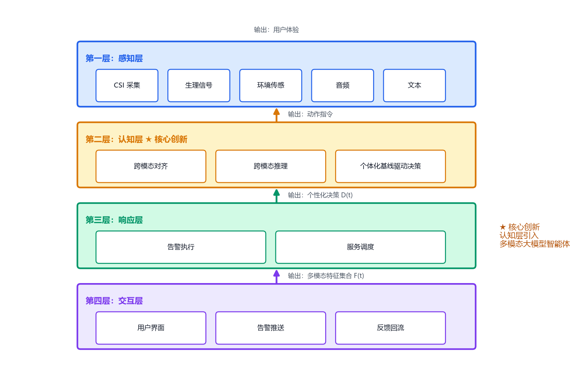
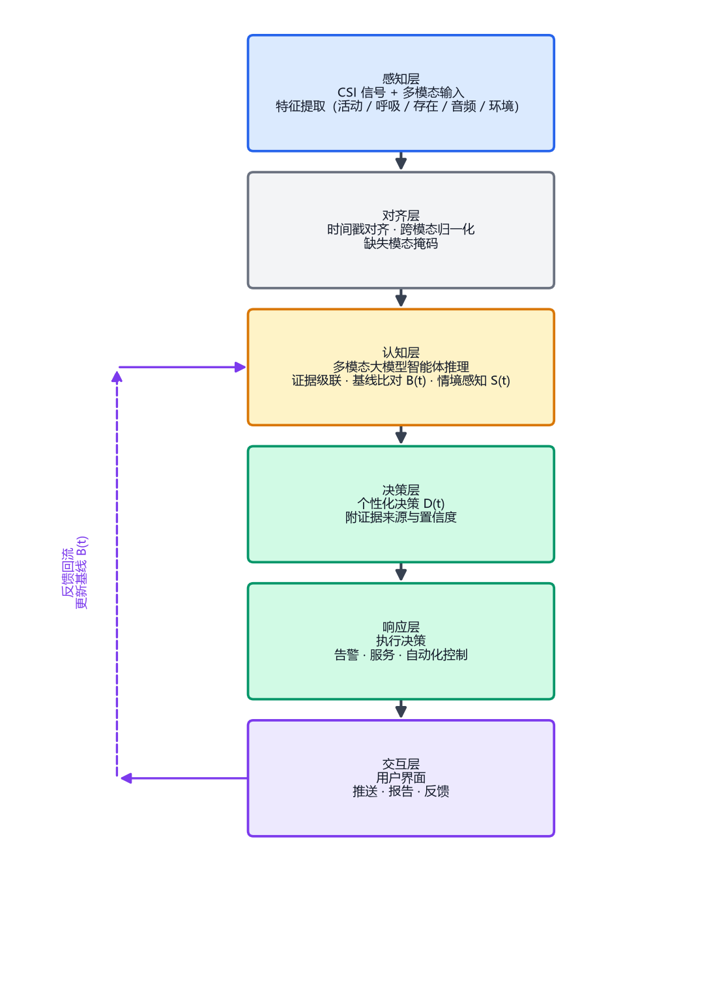
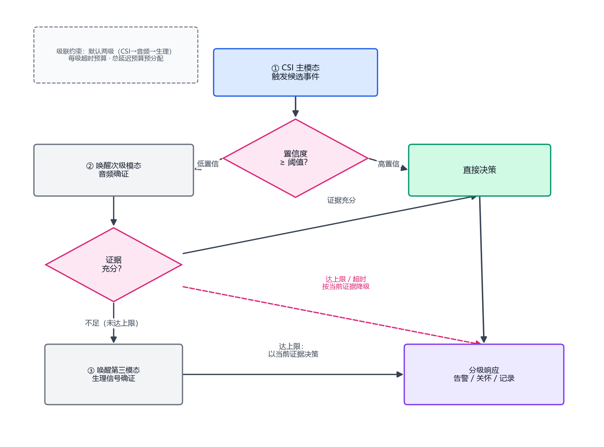
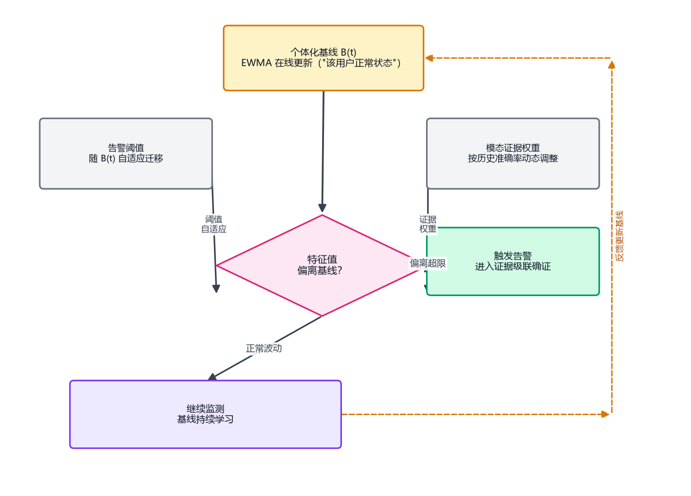
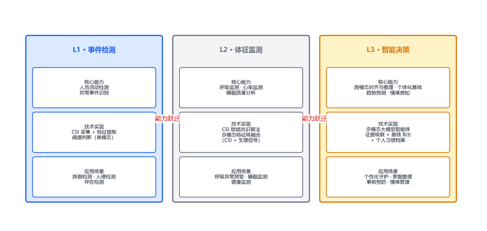
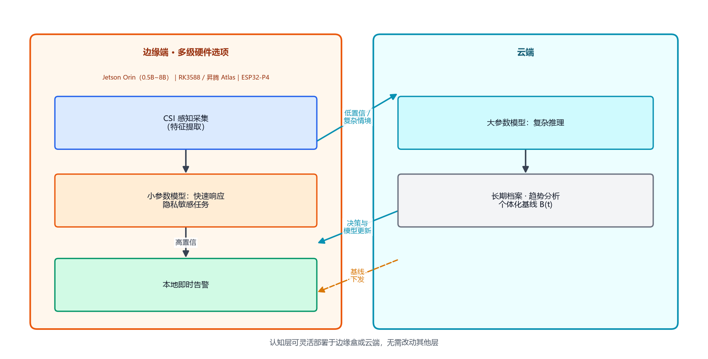

# 多模态大模型智能体与 WiFi CSI 感知融合的通用技术框架：从事件检测到智能决策

> **作者**：杨博
> **日期**：2026 年 8 月 23 日
> **版本**：v1.3
> **DOI**：10.5281/zenodo.22065374
> **性质**：立场论文 / 初步技术报告（position paper / preliminary technical report），以学术公开记录确立写作优先权

---

## 摘要

**本文性质说明**：本文为立场论文（position paper）/ 初步技术报告（preliminary technical report），以学术公开记录的方式阐述技术框架与初步实证结果，技术方案的完整性与成熟度以正文描述为准。

WiFi 信道状态信息（CSI）感知是一种典型的使能技术（enabling technology）：其本身不构成产品，价值在于与智能决策能力结合后，在垂直场景中衍生出丰富的应用（这一特性可类比于电力之于电器产业）。本文提出了一种多模态大模型智能体与 WiFi CSI 感知融合的通用技术框架，核心创新在于：从传统的"事件检测"范式（检测到异常 → 告警）升级为"智能决策"范式（多模态感知 → 跨模态对齐与推理 → 个体化基线驱动的个性化决策 → 体验闭环）。本文阐述了该框架的四层解耦架构、多模态融合与对齐机制、L1-L3 能力演进路线与形式化定义，并以居家养老场景的应用实例说明落地路径；进而论证该框架可向智慧医疗、智能安防、工业自动化、智慧办公、教育、智能家居、零售、体育训练、睡眠医学等场景扩散（不限于以上）。初步实测验证表明（已验证模态为 CSI + 音频，生理与环境模态为架构设计能力）：活动检测信噪比达 12.2:1（标准 3:1），无接触呼吸检测误差 0.2 次/分，语音确证机制可吸收约 90% 的误报，验证了"CSI 感知 + 多模态大模型智能体"融合路径中证据级联与个体化基线驱动决策的可行性。

**关键词**：WiFi CSI 感知；多模态大模型智能体；跨模态对齐；多模态融合；个体化基线；智能决策；使能技术；范式升级

---

## 1 引言

### 1.1 研究背景

WiFi CSI（Channel State Information）感知技术通过分析 WiFi 信号在传播过程中的细微变化，实现对环境中人体活动的精准识别。该技术具有隐私友好（不采集图像）、无感部署（无需穿戴）、穿透性好（可穿薄墙）等优势，被认为是下一代感知技术的重要方向。

本文的一个核心视角是：**CSI 感知是一种使能技术（enabling technology），其价值实现的关键不在于技术本身，而在于与新一代智能决策能力（多模态大模型智能体）结合后，在垂直场景中持续衍生应用**。为帮助读者直观理解这一性质，可以类比电力的发现之于电器产业：电力本身不构成产品，但与电机、照明、通信等应用能力结合后，衍生出无穷尽的电器品类。需要指出的是，该类比仅用于直观理解，其学术对应物是经济学中的"通用目的技术"（General Purpose Technology, GPT）概念——能广泛扩散、持续改进并催生创新集群的基础技术 [12]。

### 1.2 问题提出

当前 CSI 感知领域的研究和产品主要集中在"事件检测"层面——检测到跌倒、检测到呼吸异常、检测到存在。这种范式的本质是"标准化阈值检测"：当信号变化超过某个固定阈值时触发告警。

然而，这种范式存在三个根本性问题：
1. **缺乏上下文理解**：无法结合历史数据、场景信息进行综合判断；
2. **缺乏个性化**：统一阈值无法适应不同个体、不同场景的差异；
3. **缺乏智能决策**：只能检测事件，不能推理意图、预测趋势。

### 1.3 本文贡献

1. 将 CSI 感知定位为使能技术（enabling technology），提出其价值实现依赖于与智能决策能力结合的认知框架；
2. 提出"多模态大模型智能体 + CSI 感知"的通用技术框架及形式化定义，明确跨模态对齐机制、多模态融合策略与个体化基线更新的技术要素；
3. 定义从"事件检测"到"智能决策"的范式升级路径，提出 L1-L3 能力演进路线；
4. 以居家养老场景的应用实例说明落地路径，并论证框架向多垂直场景扩散的可能性（不限于本文所列场景）。

---

## 2 相关工作

### 2.1 WiFi CSI 感知技术的发展

WiFi CSI 感知技术自 2010 年代初期开始发展，经历了从基础存在检测到细粒度行为识别的演进。

**早期奠基工作**：
- Halperin et al. (2011) 首次将 CSI 引入室内感知领域，证明了 CSI 相比 RSSI 在感知精度上的显著优势 [4]。
- Wang et al. (2014) 提出 D-WFT 方法，首次实现基于 CSI 的细粒度人体活动识别 [5]。
- Zhang et al. (2018) 系统综述了 CSI 感知在健康监护中的应用，涵盖跌倒检测、呼吸监测、手势识别等方向 [6]。

**近年进展**：
- Yang et al. (2023) 提出 SenseFi 基准数据集与开源库，为 CSI 感知研究提供标准化评测平台 [2]。
- Li et al. (2025) 提出 WiLife 系统，首次实现基于 WiFi 信号的老年人长期日常状态监测与习惯挖掘，验证了 CSI 在长期健康监测中的可行性 [7]。
- 中兴通讯 (2022) 提出基于 Wi-Fi Sensing 的行为习惯模型与异常预警方案，在智慧养老场景中实现了活动规律分析与行为偏离检测 [8]。

### 2.2 大模型与多模态模型在感知领域的应用

大模型在 IoT/感知领域的应用刚刚起步，是一个前沿交叉方向。值得注意的是，2024 年以来，通用大模型已从纯文本模型（LLM）快速演进为多模态模型（如 GPT-4o、Gemini、Qwen-VL 等），具备同时理解文本、图像、音频的能力；在感知系统中，还存在 CSI、生理信号、环境传感等非视觉模态。本文所述"多模态大模型智能体"即指以多模态大模型为推理核心、以跨模态对齐机制接入异构感知输入的智能体，而非"语言模型 + 简单接口"的组合。

**相关工作**：
- Wi-Chat (2025) 是首个将大语言模型与 WiFi CSI 结合的工作，实现了基于 CSI 信号的对话式环境感知 [9]。
- IoT-LLM (2024) 提出大模型驱动的 IoT 决策框架，将传感器数据与大模型推理结合，实现智能决策 [10]。
- Emerald（MIT, 2026）已将 WiFi 感知技术用于医疗健康监护，实现无接触呼吸/心率监测、帕金森步态追踪、睡眠阶段分析等功能 [11]。

**关键发现**：截至 2026 年，NTU Awesome-WiFi-CSI-Sensing 清单收录的上百篇论文中，涉及"LLM + WiFi-CSI"的仅有 2 篇（Wi-Chat 2025、IoT-LLM 2024）；而涉及"多模态大模型智能体 + CSI 跨模态对齐"的完整系统级工作**尚未发现**，表明这一交叉方向处于极早期阶段。

**技术特征对比**：表 1 将本框架与最相关工作的技术特征逐项对比（基于公开资料检索的判断，以各原文为准），用于界定差异化创新点：

| 技术特征 | 本框架 | Wi-Chat [9] | IoT-LLM [10] | Emerald [11] |
|---|---|---|---|---|
| 大模型认知层 | ✅ 多模态智能体 | ✅ LLM 对话式 | ✅ LLM 决策 | ❌ 无 LLM |
| 跨模态对齐机制 | ✅ 定义 4 | 未见公开 | 未见公开 | — |
| 个体化基线驱动决策 | ✅ 定义 3 | 未见公开 | 未见公开 | 部分（非 LLM） |
| 证据级联机制 | ✅ 3.5.3 | 未见公开 | 未见公开 | — |
| 隐私分级与按需唤醒 | ✅ 3.5.5 | 未见公开 | 未见公开 | ✅ 非视觉 |

**表 1**：本框架与最相关工作的技术特征对比（基于公开资料，以原文为准）

该对比表明："证据级联机制 + 个体化基线驱动决策"这一组合在本框架之外的相关工作中均未完整出现，构成最清晰的技术差异化特征。

### 2.3 现有方案的局限性

现有 CSI 感知方案主要集中在"事件检测"层面，存在以下根本性局限：

1. **缺乏上下文理解**：传统方案仅基于当前信号特征进行判断，无法结合历史数据、场景信息、用户画像进行综合推理 [5][6]。
2. **缺乏个性化**：统一阈值无法适应不同个体、不同环境的差异，导致高误报率或漏报率 [7]。
3. **缺乏智能决策**：只能检测事件并触发固定告警，无法推理意图、预测趋势、生成个性化决策 [8]。
4. **缺乏体验闭环**：现有方案多为单点检测，缺乏"感知→认知→交互→服务"的端到端闭环。
5. **缺乏跨模态推理**：现有方案以单一模态（CSI）或简单拼接为主，缺乏对异构模态的时序对齐、跨模态推理与证据级联机制。

本文提出的框架正是针对上述局限性，引入多模态大模型智能体作为"认知层"，实现从"事件检测"到"智能决策"的范式升级。

---

## 3 通用技术框架

### 3.1 形式化定义

设 CSI 信号流为 $C(t) = \{c_1(t), c_2(t), \ldots, c_N(t)\}$，其中 $c_i(t)$ 为第 $i$ 个子载波在时刻 $t$ 的复信道响应，$N$ 为子载波数（本文实测系统 $N=192$）。

**定义 1（感知映射）**：感知层定义映射 $f_{sense}: C(t) \rightarrow F^{CSI}(t)$，其中 $F^{CSI}(t) = \{f_{act}(t), f_{resp}(t), f_{pres}(t), \ldots\}$ 为 CSI 特征向量，分别对应用户活动强度、呼吸节律、在场状态等语义特征。

**定义 2（多模态感知集合）**：认知层的输入为多模态特征集合 $\mathcal{F}(t) = \{F^{CSI}(t), F^{physio}(t), F^{env}(t), F^{audio}(t), F^{text}(t)\}$，其中：
- $F^{CSI}(t)$ 为 CSI 感知特征（活动、呼吸、存在）；
- $F^{physio}(t)$ 为生理信号特征（心率、呼吸率等辅助生理数据）；
- $F^{env}(t)$ 为环境上下文特征（时间、位置、温湿度、场景类别）；
- $F^{audio}(t)$ 为音频线索特征（语音确认应答、环境声事件）；
- $F^{text}(t)$ 为文本线索特征（用户偏好记录、医疗病史条目、交互日志）。

**定义 3（认知映射）**：认知层定义映射 $f_{cog}: (\mathcal{F}(t), H, B(t), S(t)) \rightarrow D(t)$，其中：
- $H$ 为用户静态上下文（如病史、偏好档案）；
- $B(t)$ 为个体化基线（随 $t$ 动态更新，刻画"该用户正常状态"的统计模型）；
- $S(t)$ 为场景上下文（时间、位置、环境状态）；
- $D(t)$ 为个性化决策输出（告警策略、建议、控制指令）。

**定义 4（跨模态对齐映射）**：认知层首先对多模态输入执行对齐映射 $f_{align}: \mathcal{F}(t) \rightarrow \mathcal{\tilde{F}}(t)$，将异构模态对齐到统一时间轴与可比特征空间，具体包括：时间戳对齐（按统一时钟重采样）、跨模态特征归一化（各模态特征标准化到一致分布）、缺失模态鲁棒处理（缺失模态以掩码占位或退化推理，不中断决策）。

**定义 5（范式升级）**：传统事件检测范式满足 $D(t) = g(F^{CSI}(t); \theta_0)$（全局固定阈值 $\theta_0$，单一模态）；本文智能决策范式满足 $D(t) = f_{cog}(f_{align}(\mathcal{F}(t)), H, B(t), S(t); \Theta)$，决策由多模态证据、个体上下文与历史共同决定。两式之差异即为本文核心贡献所在。

### 3.2 四层解耦架构

图 1 展示了本框架的四层解耦架构：

**图 1**：四层解耦架构示意图

**关键创新**：第二层"认知层"引入多模态大模型智能体，承担三项核心职责：**（1）跨模态对齐**——将 CSI、生理、环境、音频、文本等异构模态对齐到统一时间轴与特征空间；**（2）跨模态推理**——基于对齐后的多模态证据进行情境感知推理（而非规则引擎）；**（3）个体化基线驱动的决策**——结合动态更新的个体基线 $B(t)$ 生成个性化决策 $D(t)$。

各层之间通过定义明确的接口解耦：感知层的输出是多模态特征集合 $\mathcal{F}(t)$，认知层的输出是决策 $D(t)$，响应层将决策转化为动作，交互层将动作转化为用户体验。这种解耦设计使感知硬件可即插即升级（如毫米波雷达、Wi-Fi 8 通感 AP 均可替换感知层而不影响上层），也使认知层可随多模态大模型能力演进而不需改动其他层；新增模态仅需实现感知层接口与对齐模块，即插即用。

### 3.3 多模态大模型智能体的核心能力

表 1 对比了传统方案与多模态大模型智能体方案的核心能力差异：

| 能力 | 传统方案 | 多模态大模型智能体方案 |
|---|---|---|
| **输入模态** | 单一 CSI 信号 | CSI + 生理 + 环境 + 音频 + 文本（可插拔） |
| **上下文理解** | 无（只看当前信号） | 结合历史数据、场景信息、跨模态证据 |
| **个性化** | 统一阈值 | 学习个体基线，千人千面 |
| **意图推理** | 无法推理 | 推断行为意图（跌倒 vs 躺下休息） |
| **趋势预测** | 事后告警 | 事前预警（"最近 7 天活动量持续下降"） |
| **跨模态推理** | 无 | 证据级联：CSI 异常 + 音频确认 + 病史关联 |
| **隐私控制** | 无区分 | 敏感模态按需唤醒、去标识化处理 |

**表 2**：多模态大模型智能体与传统方案的能力对比

### 3.4 智能决策流程

图 2 展示了本框架的端到端智能决策流程：

**图 2**：端到端智能决策流程图

### 3.5 多模态融合与对齐的实现要点

为使框架具备可实施性与可复现性，本节明确列出多模态融合与对齐的关键实现要素。

**3.5.1 输入模态集合**（可按场景裁剪，缺省时自动降级）

| 模态 | 数据源 | 典型特征 | 隐私等级 |
|---|---|---|---|
| CSI | ESP32-S3 等 WiFi 设备 | 活动强度、呼吸节律、在场状态 | 低（非视觉） |
| 生理 | 毫米波雷达/可选穿戴 | 心率、呼吸率 | 中 |
| 环境 | 温湿度/时间/位置 | 场景上下文 | 低 |
| 音频 | 语音确认、环境声 | 应答状态、异常声响 | 中（去标识化） |
| 文本 | 用户偏好、病史、交互日志 | 静态上下文 H | 高（加密存储） |

**3.5.2 模态对齐策略**

- **时间戳对齐**：所有模态按统一时钟重采样至同一时间轴（帧级对齐），消除各传感器时钟漂移；
- **跨模态特征归一化**：各模态特征分别标准化（如 z-score）至一致分布，避免量纲差异主导融合；
- **缺失模态鲁棒处理**：单一模态缺失时以掩码占位并降级推理（如音频通道故障时仅用 CSI 决策），保证系统可用性。

**3.5.3 跨模态融合方法**（三级递进，按置信度需求选择）

1. **特征级融合**：对齐后的特征拼接为联合向量，输入多模态模型联合编码（适用于模态齐全、算力充足场景）；
2. **决策级融合**：各模态独立推理后按模态证据权重加权汇总（计算开销小、可解释性强）；
3. **证据级联机制**：主模态（CSI）触发候选事件 → 次级模态（音频/生理）按需唤醒确证 → 高置信度事件直接决策、低置信度事件继续唤醒更多模态，形成按需级联的证据链。

**级联深度控制与超时降级**：为避免多轮推理的延迟累积，证据级联设计如下约束：**（1）级联最大轮数**——单次事件的模态唤醒链设上限（默认两级，如 CSI → 音频 → 生理），达到上限后无论置信度如何均以当前证据决策；（2）**超时降级规则**——每级确证设超时预算，若次级模态在预算内未返回结果，则按当前证据直接降级决策（保守处理：升级告警或按规则版兜底），保证系统时延上限有界；（3）**延迟预算分配**——总响应预算（如 3 秒）按级联深度预分配，浅级联（单模态高置信）获得全额预算，深级联每级压缩推理时间。该约束设计使"证据级联"与"实时响应"相容，亦构成值得后续研究优先验证的具体技术特征。

**图 3**：证据级联机制示意图（含级联深度控制与超时降级）

**3.5.4 决策输出与自适应机制**

- 决策 $D(t)$ 由多模态证据联合支撑，输出附带证据来源与置信度，供用户审计；
- **个体化基线更新**：$B(t)$ 采用指数加权移动平均（EWMA）等在线方法持续更新，表征"该用户正常状态"；基线偏离度作为核心决策输入；
- **模态证据权重动态调整**：依据各模态历史准确率动态调整权重，高准确率模态自动获得更高话语权；
- **阈值自适应**：告警阈值随个体基线 $B(t)$ 漂移而自适应迁移，避免固定阈值的千人一面问题。

**核心特征组合**：纵观全框架，"证据级联机制（3.5.3）+ 个体化基线驱动的自适应决策（本节）"构成**技术特征最具体、与现有技术（Wi-Chat、IoT-LLM）差异最清晰的特征组合**，是本文主张的核心创新点：证据级联解决"多模态按需确证"问题，个体化基线解决"千人千面决策"问题，二者联合实现从固定阈值告警到情境自适应决策的跃迁。该组合可作为后续研究优先验证的核心方向；其余创新点（四层解耦、三级融合、L1-L3 路线等）作为支撑性特征或扩展研究方向。

**图 5**：个体化基线与阈值自适应决策循环

**3.5.5 安全性与隐私保护的嵌入点**

- **敏感模态访问控制**：高隐私等级模态（文本病史、生理）默认关闭，仅在高置信度事件确证时按需唤醒；
- **去标识化**：音频线索仅提取事件级特征（应答/未应答），不存储原始音频；文本病史加密存储、最小权限访问；
- **本地优先**：隐私敏感数据的特征提取在本地完成，云端仅接收特征向量与决策结果（见第 8.2 节端云协同）。

---

## 4 L1-L3 能力演进路线

图 4 展示了本框架的 L1-L3 能力演进路线：

**图 4**：L1-L3 能力演进路线图

### 4.1 L1 阶段：事件检测

- **核心能力**：人员活动检测、异常事件识别
- **技术实现**：CSI 信号采集 + 特征提取 + 阈值判断（单模态）
- **应用场景**：跌倒检测、入侵检测、存在检测

### 4.2 L2 阶段：体征监测

- **核心能力**：呼吸监测、心率监测、睡眠质量分析
- **技术实现**：CSI 锁频共识算法、多模态特征级融合（CSI + 生理信号）
- **应用场景**：呼吸异常预警、睡眠监测、健康监测

### 4.3 L3 阶段：智能决策

- **核心能力**：跨模态对齐与推理、个体化基线、趋势预测、情绪感知
- **技术实现**：多模态大模型智能体 + 证据级联 + 个体化基线 $B(t)$ + 个人习惯档案
- **应用场景**：个性化守护、意图推理、事前预防、情绪管理

---

## 5 多场景应用

本文提出的通用技术框架具有广泛的适用性，其核心在于"多模态大模型智能体 + CSI 感知"的融合架构，该架构不局限于特定应用场景。**以下场景仅为示例性说明，不构成对本框架应用范围的限制。**任何需要"无感监测人体状态 + 智能决策"的场景，均可应用本框架。

### 5.1 种子应用：居家养老场景（已验证）

**技术适配性**：该场景需要无感监测老年人活动状态、呼吸节律、情绪变化，并结合病史进行个性化告警决策；模态集合为 CSI（活动/呼吸）+ 音频（语音确证）+ 文本（病史）。

**落地示例（端到端居家守护系统）**：作者在居家养老场景构建了一个端到端守护系统作为本框架的种子应用，已实现完整链路（第 7 章概念验证即基于该系统）：
- 跌倒事件检测 → 多模态智能体融合病史信息（如心梗史）→ 生成个性化告警策略（立即告警 vs 先语音确证）；
- 呼吸节律异常监测 → 跨模态推理（活动模式 + 呼吸模式）→ 推断情绪状态（孤独/抑郁）→ 生成关怀建议；
- 活动量长期趋势分析 → 检测基线偏离（连续数天活动量下降）→ 推断健康风险增加 → 生成就医建议；
- 语音确证闭环 → 疑似事件先问老人"您还好吗"，应答消警、无应答升级 → 吸收约 90% 误报（第 7 章实测）。

该种子应用验证了"CSI 感知 + 多模态大模型智能体"融合路径的可行性。以下场景为基于框架通用性的扩散构想（尚未实验验证）。

### 5.2 智慧医疗场景（构想）

**技术适配性**：该场景需要无感监测患者术后活动、精神科患者行为模式、睡眠呼吸障碍等生理指标；可扩展生理模态（心率/血氧）。

**应用示例**：
- 术后患者活动监测 → 检测异常活动模式 → 多模态智能体推理并发症风险 → 分级告警
- 精神科患者行为模式分析 → 识别自残倾向（特定行为序列）→ 智能体推理风险等级 → 分级干预
- 睡眠呼吸暂停检测 → 推断严重程度（基于呼吸暂停频率、血氧推断）→ 生成就医建议

### 5.3 智能安防场景（构想）

**技术适配性**：该场景需要区分"人/宠物/物体"、推断行为意图（徘徊/入侵/正常通行）、实现分级响应。

**应用示例**：
- 无人时室内异常移动检测 → 多模态智能体区分"宠物"vs"人"（基于活动模式、体型推断）→ 智能告警
- 敏感区域行为序列分析 → 推断意图（徘徊 vs 入侵 vs 正常通行）→ 分级响应（提示/告警/联动）
- 多人场景区分 → 识别陌生人（基于活动模式基线）→ 安全预警

### 5.4 工业自动化场景（构想）

**技术适配性**：该场景需要监测工人操作合规性、高危区域人员存在、疲劳状态等。

**应用示例**：
- 工人操作动作序列监测 → 检测违规动作（未按标准流程操作）→ 多模态智能体推理安全风险等级 → 分级干预
- 高危区域人员存在检测 → 联动设备自动停机 → 预防事故
- 工人疲劳状态检测（活动模式变化、微动特征）→ 推断事故风险 → 提醒休息

### 5.5 智慧办公场景（构想）

**技术适配性**：该场景需要分析工位使用模式、员工健康状态、会议室占用效率等。

**应用示例**：
- 工位占用模式分析 → 多模态智能体推理使用规律 → 优化空间分配策略
- 员工长时间静止检测 → 推断健康问题（基于活动基线偏离）→ 提醒休息
- 会议室占用与活动分析 → 推断会议效率（基于活动模式、人员密度）→ 优化调度建议

### 5.6 教育场景（构想）

**技术适配性**：该场景需要监测学生专注度、课堂行为模式、学习压力等。

**应用示例**：
- 学生专注度监测（活动模式、微动特征）→ 多模态智能体分析注意力模式 → 生成教学节奏调整建议
- 课堂异常行为识别 → 推断情绪状态（焦虑/困惑/无聊）→ 生成个性化辅导建议
- 学生活动量长期分析 → 推断学习压力（基于活动基线偏离）→ 生成休息建议

### 5.7 智能家居场景（构想）

**技术适配性**：该场景需要实现人员存在检测、个性化自动化控制、作息模式推断等。

**应用示例**：
- 人员存在检测 → 多模态智能体推理用户习惯 → 自动化控制（灯光、温度、音乐）
- 多人区分 → 个性化服务（基于个人偏好基线）→ 自动化场景切换
- 活动模式分析 → 推断作息规律 → 自动化场景预设

### 5.8 零售场景（构想）

**技术适配性**：该场景需要分析顾客行为模式、店内流量分布、商品关注度等。

**应用示例**：
- 顾客行为序列分析 → 多模态智能体推理购买意图 → 生成个性化推荐
- 店内流量时空分布分析 → 推断高峰时段与热点区域 → 优化人员配置与商品陈列
- 顾客停留时间与活动模式分析 → 推断商品兴趣点 → 优化营销策略

### 5.9 体育训练场景（构想）

**技术适配性**：该场景需要分析运动员动作模式、训练负荷、疲劳程度等。

**应用示例**：
- 运动员动作模式分析 → 多模态智能体推理技术缺陷 → 生成个性化训练方案
- 训练负荷长期监测 → 推断疲劳程度（基于活动基线偏离）→ 预防运动损伤
- 动作模式对比分析 → 推断技术改进点 → 优化训练计划

### 5.10 睡眠医学场景（构想）

**技术适配性**：该场景需要分析睡眠质量、呼吸事件、体位变化等。

**应用示例**：
- 睡眠质量多维分析（呼吸节律、体动频率、离床次数）→ 多模态智能体推理睡眠障碍类型 → 生成个性化干预方案
- 呼吸暂停事件检测 → 推断严重程度（基于暂停频率、持续时间）→ 生成就医建议
- 翻身次数与体位分析 → 推断睡眠深度分布 → 优化睡眠环境建议

### 5.11 其他潜在场景（构想）

本框架的通用性使其可应用于更多垂直领域，包括但不限于：

- **康复医学**：患者康复训练动作监测 → 推断康复进度 → 优化训练方案
- **心理咨询**：来访者微动模式分析 → 推断情绪状态 → 辅助心理评估
- **监狱管理**：囚犯行为模式监测 → 推断异常行为 → 安全预警
- **酒店服务**：客人作息模式分析 → 推断服务需求 → 个性化服务
- **图书馆管理**：座位占用分析 → 推断使用规律 → 优化资源配置

**以上场景仅为示例，本框架的应用范围不限于上述场景。任何需要"无感监测人体状态 + 智能决策"的场景，均可应用本框架。种子应用验证了融合路径的可行性，后续场景可由同一框架复用感知层与认知层能力，仅需适配响应层与交互层，并通过可插拔模态接口扩展该场景所需的模态。** 

---

## 6 技术优势

### 6.1 与传统方案的对比

| 维度 | 传统方案 | 本文方案 |
|---|---|---|
| **感知层** | CSI 信号 → 特征提取（单模态） | CSI + 多模态输入 → 特征提取 + 对齐 |
| **认知层** | 规则引擎 / 阈值判断 | **多模态大模型智能体（跨模态对齐 + 推理）** |
| **决策层** | 固定逻辑 | **个体化基线驱动的个性化决策** |
| **交互层** | 简单告警 | **体验闭环（反馈回流更新基线）** |

### 6.2 核心优势

1. **通用性**：同一套框架可应用于多个垂直场景，模态可插拔
2. **个性化**：多模态智能体学习个体基线，千人千面
3. **智能化**：从"事件检测"升级到"跨模态智能决策"
4. **可扩展**：四层解耦架构，感知硬件与推理能力均可独立演进
5. **隐私友好**：非视觉感知 + 敏感模态按需唤醒 + 去标识化

---

## 7 概念验证

为验证本框架的可行性，作者在居家养老场景构建了一个端到端守护系统，并基于该系统进行了初步概念验证（Proof of Concept）。

### 7.1 伦理声明与数据治理

本研究涉及的人体监测数据采集均在作者家庭成员自愿参与下完成（家属亲测），所有参与者在实验前已知悉实验目的、监测方式与数据处理方式，并口头同意参与。数据仅用于技术验证目的，不涉及任何商业用途。

面向多模态数据特性的数据治理原则（框架设计，PoC 阶段已部分落实）：

1. **数据最小化**：仅在必要模态上采集数据，尽量减少跨模态推断的敏感信息暴露；PoC 中文本病史模态以最小字段使用；
2. **同意与退出机制**：设计清晰的用户同意书模板；用户有权随时删除数据、退出监测；对未成年人及第三方数据按法定监护与授权要求处理；
3. **存储与访问控制**：分区化存储（原始信号、特征向量、决策结果分区隔离）、最小权限原则、传输加密（TLS）、访问日志审计；
4. **区域法规对接**：中国市场遵循《个人信息保护法》（PIPL）与 GB/T 35273-2020 最小必要原则；海外市场分别对接 GDPR（欧盟，含数据可携带权与删除权）与 HIPAA（美国，医疗健康数据保护）要点，各市场合规路径在第 8.3 节进一步讨论；
5. **敏感推断的边界**：情绪/健康状态推断的结果仅用于关怀与提醒，不用于评判或商业画像；推断输出附带可解释说明，用户可关闭特定推断能力。
6. **情绪/心理状态推断的专项合规条款**：鉴于情绪/心理状态（如孤独、抑郁倾向）的推断在多数司法辖区属于高敏感类别（欧盟 GDPR 将心理健康信息归入"健康数据"特殊类别；中国对精神卫生相关数据从严保护），本框架针对该类推断设定专项约束：**（1）非诊断声明**——情绪/心理推断结果不构成任何医学或心理学诊断，仅作为健康关怀提醒的参考信息；（2）**更高级别的明示同意**——启用情绪/心理推断能力须取得用户的单独明示同意（区别于一般监测的概括同意），且用户可随时单独关闭；（3）**结果呈现约束**——该类推断结果仅向用户本人或其授权监护人展示，不进入告警链、不用于任何自动化决策（如保险定价、雇佣评估）；（4）**最小保留**——情绪推断的中间特征不持久化，仅保留推断结论且限期删除。

### 7.2 实验设置

- **硬件**：ESP32-S3 开发板 ×2（TX 发射 / RX 接收），ESP-NOW 协议，信道 11，HT40，发包率 100 包/秒，192 子载波，实收帧率约 71~73 帧/秒
- **场地**：室内居家环境，门窗关闭，无风扇/空调气流，单人在场
- **部署**：两板间距 1~3 米，受试者位于两板连线中点，胸腔正对连线
- **模态配置**：CSI（活动/呼吸）+ 音频（语音确证）+ 文本（病史最小字段）；PoC 以 CSI 为主模态、音频为证据级联的次级模态。**需要说明的是，五模态集合中已验证的仅为上述 CSI + 音频（部分时段降级为规则版）+ 极简文本字段；生理信号与环境上下文模态属于架构设计能力（3.5.1），尚未实测**，其实证验证列入 7.6 节扩展 PoC 计划。
- **大模型**：通义千问（Qwen）API（语音确证在测试期间因 API 认证问题部分时段降级为规则版）
- **监测维度**：活动检测、呼吸监测、作息模式

### 7.3 初步结果

表 2 汇总了概念验证的关键实测结果：

| 指标 | 实测结果 | 判定标准 | 判定 |
|---|---|---|---|
| 活动检测信噪比 | **12.2:1** | ≥ 3:1 | ✅ 通过（超标准 4 倍） |
| 呼吸检测误差 | **0.2 次/分**（受控 12 次/分，实测 12.2） | ≤ ±2 次/分 | ✅ 通过 |
| 呼吸憋气对照 | 呼吸时子载波锁频共识，憋气时共识瓦解 | 周期峰随憋气消失 | ✅ 通过 |
| 语音确证降误报 | 吸收约 90% 误报（估算值） | — | ⚠ 待定量验证 |

**表 3**：概念验证关键实测结果汇总

### 7.4 典型案例分析

**案例 1：语音确证闭环（证据级联实例）**
- 场景：系统检测到疑似跌倒事件
- 本框架：多模态智能体发起语音问询"您还好吗"→ 应答则消警，无应答则升级告警（音频模态作为 CSI 主模态的级联确证）
- 结果：通过交互吸收误报，把告警推送留给真正需要的事件，家属反馈"更安心"

**案例 2：活动/呼吸双证据交叉验证（跨模态证据级联）**
- 场景：活动检测与呼吸监测双信号线交叉验证，双证据才升级告警
- 结果：避免单一信号误判，降低误报率（机理验证，定量值待测）

### 7.5 小结

初步验证表明，"CSI 感知 + 多模态大模型智能体"融合路径在技术层面可行：活动检测信噪比超过标准 4 倍，无接触呼吸检测误差 0.2 次/分。但由于样本量较小（家庭成员、单一居室环境），结果尚不具有统计显著性，需要更大规模的实验验证。语音确证降误报的"90%"为当前估算值，有待定量实验确认。

### 7.6 扩展 PoC 设计（未来实验蓝图）

为提升说服力与可复现性，扩展 PoC 按下述设计推进：

1. **模态集合扩展**：CSI + 生理信号（呼吸/心率）+ 场景上下文 + 语音/音频线索，验证全模态证据级联；
2. **评估指标**：精确度（Precision）、灵敏度（Recall）、特异度（Specificity）、F1、鲁棒性（模态缺失/干扰条件下的表现）、响应时延、隐私合规指标（敏感数据暴露面、去标识化覆盖率）；
3. **实验设计**：多房型/不同家具布置、不同人员与场景、跨时间段的长期评估，设对照组（传统阈值方案）对比效应；
4. **统计分析**：显著性检验（配对 t 检验 / Wilcoxon）、置信区间、对比基线的效应大小（effect size）报告。

---

## 8 讨论

### 8.1 局限性

本框架存在以下局限性：

1. **CSI 环境敏感性**：CSI 信号易受环境变化影响（家具移动、门窗开关、其他电器干扰），需要定期校准。跨环境迁移能力是当前 CSI 感知领域的公认难题 [2][6]。
2. **大模型推理延迟**：大模型推理可能需要 1-3 秒，不适合需要毫秒级响应的实时告警场景。未来可通过边缘计算（将推理下沉到本地设备）降低延迟。
3. **隐私合规**：个体化基线涉及敏感数据（活动模式、呼吸数据、情绪推断），多模态扩展进一步增大数据面，需要严格遵守《个人信息保护法》等法规，落实数据最小化、分区存储与退出机制。
4. **概念验证规模有限**：当前仅在家庭成员、单一居室环境中验证，样本量较小，结果的统计显著性有待更大规模实验确认。语音确证降误报的"90%"为估算值，尚未定量验证。
5. **多模态融合的实证缺失**：PoC 仅验证了 CSI + 音频两级证据级联，生理、环境、文本模态的联合推理尚未实测；即标题与摘要中的"多模态"目前更体现为架构设计能力而非完整的实证能力。跨模态对齐算法在真实部署中的鲁棒性有待验证，扩展 PoC（7.6）将优先补齐生理模态实测——这是当前实证说服力最大的缺口。

### 8.2 未来工作

未来工作包括：

1. **跨环境迁移**：研究 CSI 模型的跨环境泛化能力，减少部署时的校准成本。可借鉴迁移学习、领域自适应等方法。
2. **边缘计算与端云协同**：将多模态推理下沉到边缘设备，降低延迟、保护隐私。当前边缘平台已形成多级选项：嵌入式 GPU（如 NVIDIA Jetson Orin 系列，可运行 0.5B~8B 参数模型）、国产 NPU（如瑞芯微 RK3588、华为昇腾 Atlas，成本敏感场景优先）、轻量 SoC（如 ESP32-P4，仅支持极小模型）。工程实践中更可行的是**端云协同架构**：边缘侧运行小参数模型完成快速响应与隐私敏感任务，云端运行大参数模型完成复杂推理与长期趋势分析。本框架的四层解耦架构天然支持该部署模式——认知层可灵活部署于边缘盒或云端，无需改动其他层。

**图 6**：端云协同部署架构

3. **多模态融合深化**：按 3.5 节蓝图实现完整模态集合，验证三级融合方法（特征级、决策级、证据级联）在不同场景下的最优选择，并补齐扩展 PoC 的评估指标与统计分析。
4. **大规模验证**：在多个家庭、多个场景中开展大规模实验，验证框架的通用性和鲁棒性。
5. **IEEE 802.11bf 标准适配**：跟踪 WLAN 感知标准进展，确保框架与未来 WiFi 芯片的原生感知能力兼容。

### 8.3 潜在挑战与风险应对

本框架面临以下挑战及应对策略：

1. **标准化**：缺乏统一的 CSI 感知标准，不同硬件平台的 CSI 数据格式、采样率、子载波数不同，影响模型的可移植性。**应对**：四层解耦架构以特征向量为接口，屏蔽底层差异；关注 IEEE 802.11bf 进展。
2. **数据飞轮**：需要大规模真实场景数据训练模型，但数据采集涉及隐私，获取难度大。**应对**：联邦学习、差分隐私等隐私计算技术；家属亲测起步的渐进式数据积累。
3. **生态兼容**：需要与大厂生态（华为/小米/海尔）兼容，而非对抗。四层解耦架构为生态兼容提供了基础，但具体实现仍需努力。**应对**：以开放接口参与生态，聚焦认知层差异化能力。
4. **用户接受度**：用户对"无感监测"的接受度、对"情绪推断"的隐私顾虑，都需要通过实际产品体验逐步建立信任。**应对**：推断结果透明可解释、用户可关闭敏感推断、同意与退出机制清晰。
5. **学术新颖性边界**：多模态融合领域的现有研究较多，本框架的技术新颖性依赖跨模态对齐与证据级联的具体技术要素。**应对**：持续跟踪同领域学术文献与产业进展，明确差异化技术特征（个体化基线驱动的自适应决策、缺失模态鲁棒处理、证据级联机制）。
6. **统计显著性不足风险**：小样本 PoC 结论易被质疑。**应对**：严格按 7.6 节蓝图设计对照组与统计检验，避免过度声称。

---

## 9 结论

本文从"CSI 感知如同电力一样是基础技术发现"的认知框架出发，指出其价值实现的关键在于与新一代智能决策能力结合后，在垂直场景中持续衍生应用。基于此，本文提出了多模态大模型智能体与 WiFi CSI 感知融合的通用技术框架：

1. **形式化层面**：定义了感知映射 $f_{sense}$、跨模态对齐映射 $f_{align}$ 与认知映射 $f_{cog}$，明确了传统事件检测范式（单模态固定阈值）与智能决策范式（多模态证据 + 个体上下文自适应）的形式差异；
2. **架构层面**：提出四层解耦架构（感知层→认知层→响应层→交互层），认知层承担跨模态对齐、跨模态推理与个体化基线驱动决策三项核心职责，各层接口明确，感知硬件与推理能力均可独立演进；
3. **融合层面**：给出可实施的多模态实现要点——输入模态集合、时间戳对齐与缺失模态鲁棒处理、三级跨模态融合方法（特征级/决策级/证据级联）、个体化基线更新与模态证据权重动态调整；
4. **能力层面**：定义 L1-L3 能力演进路线（事件检测 → 体征监测 → 智能决策），为不同成熟度阶段提供明确的升级路径；
5. **落地层面**：居家养老场景的端到端守护系统已完成实现，初步实测验证了融合路径的可行性（活动检测信噪比 12.2:1、呼吸检测误差 0.2 次/分、语音确证吸收约 90% 误报），并给出了扩展 PoC 的实验蓝图；
6. **扩散层面**：论证了该框架可向智慧医疗、智能安防、工业自动化、智慧办公、教育、智能家居、零售、体育训练、睡眠医学等场景扩散（不限于以上），种子应用验证的感知层与认知层能力可被后续场景复用。

本文所有技术思路、架构设计、应用场景构想均为原创，写作日期为 2026 年 8 月 23 日，以学术公开记录的方式确立写作优先权。

---

## 参考文献

[1] NTUMARS. Awesome-WiFi-CSI-Sensing[EB/OL]. https://github.com/NTUMARS/Awesome-WiFi-CSI-Sensing, 2026.

[2] Yang J, et al. SenseFi: A Library and Benchmark on Deep-Learning-Empowered WiFi Human Sensing[J]. Patterns, 2023, 4(3).

[3] Emo-CSI: The emotional state classification using physiological signal interpretation framework[C]. 2025.

[4] Halperin D, et al. Toolchain: High-resolution indoor localization using WiFi MIMO[C]. ACM MobiSys, 2011.

[5] Wang W, et al. D-WFT: A fine-grained human activity recognition system using WiFi CSI[C]. ACM UbiComp, 2014.

[6] Zhang D, et al. A survey on wireless channel state information (CSI) based human activity recognition[J]. IEEE Communications Surveys & Tutorials, 2018.

[7] Li S, et al. WiLife: Long-Term Daily Status Monitoring and Habit Mining of the Elderly Leveraging Ubiquitous Wi-Fi Signals[J]. ACM Transactions on Computing for Healthcare, 2025, 6(1): 10:1-10:29.

[8] 中兴通讯. Wi-Fi Sensing 技术应用探讨[J]. 中兴技术, 2022.

[9] Wi-Chat: Conversational WiFi CSI Sensing with Large Language Models[C]. 2025.

[10] IoT-LLM: Large Language Model driven IoT Decision Framework[C]. 2024.

[11] Emerald (MIT). WiFi-based Contactless Health Monitoring[EB/OL]. https://www.emerald.mit.edu, 2026.

[12] Bresnahan T F, Trajtenberg M. General purpose technologies: Engines of growth?[J]. Journal of Econometrics, 1995, 65(1): 83-108.

---

## 原创性声明与时间戳

**本文所有技术分析内容均为原创**：

1. ✅ 将 CSI 感知定位为使能技术（enabling technology）的认知框架
2. ✅ "多模态大模型智能体 + CSI 感知"的通用技术框架及形式化定义（定义 1-5）
3. ✅ 四层解耦架构（感知层→认知层→响应层→交互层），认知层承担跨模态对齐、跨模态推理与个体化基线驱动决策
4. ✅ 跨模态对齐机制（时间戳对齐、特征归一化、缺失模态鲁棒处理）与三级跨模态融合方法（特征级/决策级/证据级联）
5. ✅ 从"事件检测"到"智能决策"的范式升级理论
6. ✅ 个体化基线 B(t) 更新机制与模态证据权重动态调整、阈值自适应策略
7. ✅ L1-L3 能力演进路线（事件检测 → 体征监测 → 智能决策）
8. ✅ 多场景扩散构想（智慧医疗、智能安防、工业自动化等，不限于以上场景）
9. ✅ 居家养老种子应用验证融合路径可行性的实证结论
10. ✅ 多模态大模型智能体的核心能力定义（跨模态推理、上下文理解、个性化、意图推理、趋势预测）
11. ✅ 面向多模态的数据治理原则（数据最小化、同意退出、分区存储、区域法规对接）
12. ✅ 扩展 PoC 实验蓝图（多模态评估指标、对照组设计与统计分析方法）

**写作日期**：2026 年 8 月 23 日
**作者**：杨博

本文作为作者原创作品的技术公开记录，写作日期与发布时间以公开发布平台的时间戳为准。本文永久存档于 Zenodo（DOI：10.5281/zenodo.22065374）。依据《中华人民共和国著作权法》，本文的著作权自创作完成之日起自动产生。任何对本文内容的转载、引用、演绎，请注明出处。
